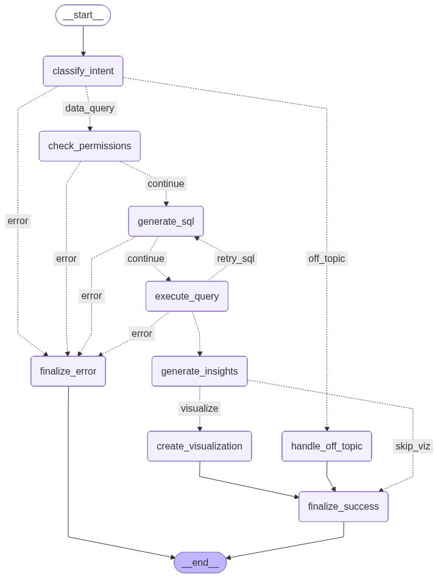

# Data Analysis and Visualization Agent 

Intelligent data analysis system that converts natural language queries into SQL, executes them, generates insights, and creates visualizations.

## Features

- **Natural Language to SQL**: Ask questions in plain English, get accurate SQL queries
- **Multi-Database Support**: Works with Chinook, Sakila, and Northwind databases and can be extended to new databases
- **Intelligent Visualizations**: Auto-generates appropriate charts (bar, line, pie, scatter)
- **Role-Based Security**: Fine-grained table access control by user role
- **Conversation Memory**: Multi-turn conversations with context awareness
- **Intent Classification**: Distinguishes data queries from off-topic questions
- **Self-Healing/Correction SQL**: Automatic retry with error correction on query failures
- **Observability**: Langfuse integration for tracing and monitoring

## Architecture

We are using Langgraph framework to orchestrate the workflow for agents

### LangGraph Workflow

<p align="center">
  
</p>


**Key Components:**
- **Intent Classifier**: Routes queries (data_query, follow_up, off_topic)
- **Analysis Agent**: Generates and validates SQL with structured outputs
- **Visualization Agent**: Recommends and creates charts based on data characteristics.
- **Conversation Manager**: Maintains session context for follow-ups
- **Permission Manager**: Enforces role-based table access

## Demo

<iframe src="https://archive.org/embed/demo_agent_202511" width="560" height="384" frameborder="0" webkitallowfullscreen="true" mozallowfullscreen="true" allowfullscreen></iframe>

## 🚀 Quick Start

### Installation
```bash
# Clone the repository
git clone https://github.com/Asad-Ismail/query-analysis-plot-agent.git
cd query-analysis-plot-agent

# Install dependencies
pip install -r requirements.txt

# Or use uv (faster and recommended)
bash uv_install.sh
```

### Configuration

Create a `.env` file:
```env
OPENAI_API_KEY=your_api_key_here
OPENAI_API_BASE=https://api.openai.com/v1  # Optional custom endpoint
LANGFUSE_SECRET_KEY = langfuse_secret_here
LANGFUSE_PUBLIC_KEY = langfuse_key_here
LANGFUSE_BASE_URL = langfuse_base_url
```

### Usage

#### CLI Mode
```bash
# Single query
python cli.py "Show top 5 artists by sales" --database chinook

# Interactive mode
python cli.py -i --database chinook

```

#### Web Interface
```bash
# Start backend
python app.py

# Open frontend
open index.html
```

Access at `http://localhost:5000`

##  Example Queries
```bash
# Simple retrieval
"Show me top 3 artists by revenue"

# Aggregation
"How many customers do we have in total?"

# Filtering
"List all customers who live in Berlin"

"Who are our top 5 customers by total spending?"
```


## Testing
```bash
# Run functional tests
pytest -s -v tests/test_functional_chinook.py
```

## Tools Used

- **LangChain & LangGraph**: Workflow orchestration
- **OpenAI GPT-40-mini**: LLM for SQL generation and insights
- **Langfuse**: Observability and tracing
- **Pandas**: Data manipulation
- **Matplotlib**: Visualizations
- **Flask**: Web backend
- **SQLite**: Database engine
